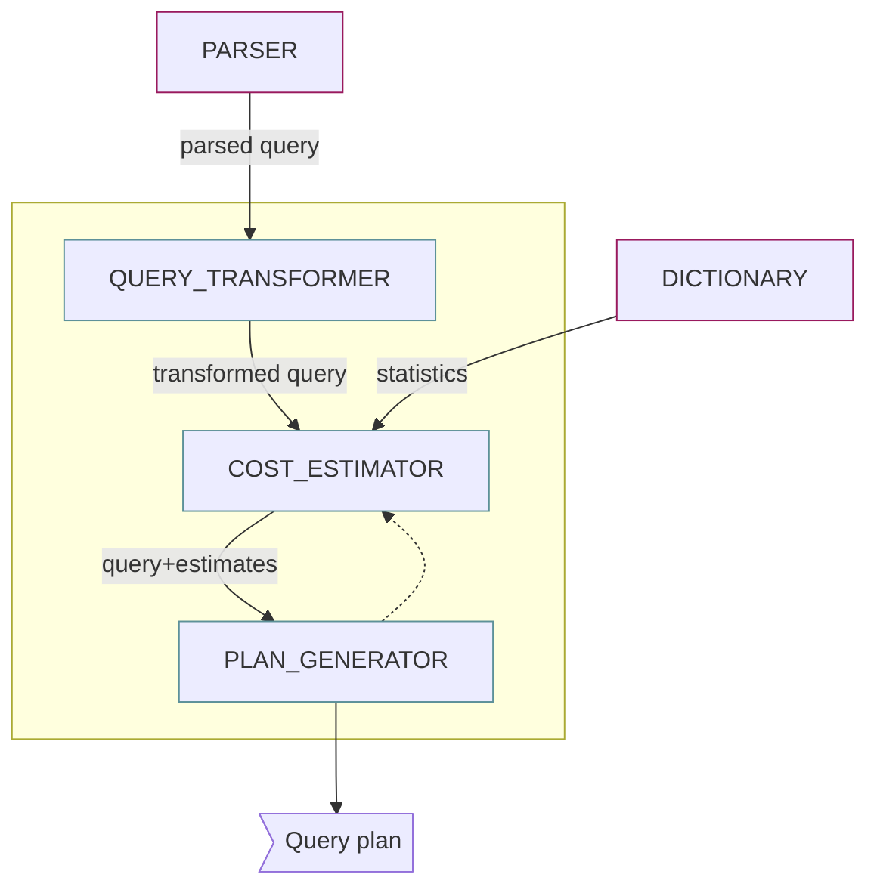

# General
<hr  style="border-color:#EE4540">
```
Declarativo y no computacional completo.
SQL utiliza su propio E/S; no utiliza el del OS
S-F-W-G-H-O 
projection -> columns & selection -> rows
```
--- start-multi-column: ID_ps9f
```column-settings
Number of Columns: 2
shadow: false
border: false
Largest Column: standard
```

**Data Manipulation Language** <b style="color:EE4540">(DML)</b>
INSERT, UPDATE, DELETE o MERGE

**Data Definition Language** <b style="color:EE4540">(DDL)</b><br>
CREATE, CHANGE, REMOVE estructuras de datos

**Transaction Control Language** <b style="color:EE4540">(TCL)</b>
COMMIT, ROLLBACK, SAVEPOINT.

**Data Control Language** <b style="color:EE4540">(DCL)</b><br>
GRANT, REVOKE para dar/quitar derechos de acceso.

--- column-break ---

Modelos **ACID**
**A**tomicidad  **C**onsistencia **I**solación **D**urabilidad<hr>

Problemas de concurrencia</br>**Deadlock y Starvation**<hr>

Seguridad</br>**Autenticación y Autorización**<hr>

**Access paths**</br>Cómo acceder físicamente para recuperar los registros.


--- end-multi-column
<hr>

# Capas 
<hr  style="border-color:#EE4540">
```
Mediciones de un sistema DB
1. Throughput 2. velocidad del sistema
```

**Transaction Manager**
- Garantiza ejecucion apropiada de operaciones de BD.
- Mantiene la consistencia.
- Permite definicion de transacciones.
- Asegura limpia ejecucion de transacciones.
- Administrar acceso concurrente.

![[masthead-fade_sql.png|300]]
<h2 style="background-color:#c72c41"> Query processor</h2>
Convierte la consulta **S-F-W** en una secuencia de solicitudes de acceso a los datos. Busca el plan menos costoso a base de heuristicas. 


<h2 style="background-color:#b3283b"> Seguridad</h2>
Garantiza el accesos autorizado de los recursos/operaciones; provee autentificacion y autorizacion.
 <h2 style="background-color:#9f2334"> (Buffer | Store) manager</h2>
**Buffer/memory Manager**; responsable del manejo eficiente de la RAM.
**Storage Manager** responsable de cargar/descargar el RAM a disco.

Tabla que esta dentro del table space:
1. **Diccionario de datos / Estadisticas**
2. **Metadata**
3. **Data**
<h2 style="background-color:#8b1f2e">Recovery Manager</h2>
![[Pasted image 20240324133716.png|300]]
Se encarga de la **A**tomicidad y **D**urabilidad.
### <span style="color:#ef2c41">Bitacora</span> \\ <span style="color:#ef2c41">Log</span>
Secuencia de registros que describen las transacciones realizadas, reconstruyen la BD a un estado consistente en caso de fallo.
Resiste a fallos y asegurar que las transacciones sean atomicas. 3 clases de registros:
1. **\<start T\>**: T inicio.
2. **\<commit T\>**: T ha sido completada.
3. **\<abort T\>**: T no pudo completarse.

*Datos de un log:*
1. valor nuevo
2. valor viejo
3. ID 
4. Estado

# Algortimos
<hr  style="border-color:#EE4540">
```
Para recuperacion de BD, los valores no se updatean
<T, X, v> Transaccion T ha cambiado el elemento X y su valor anterior era. 
```
## <span style="color:#EE4540">Undo</span>
Lee la bitacora del final al inicio.  <T, X, v> Transaccion T ha cambiado el elemento X y su valor anterior era v.
**Reglas**
1. Si **T** modifica **X**, el registro debe escribirse a disco antes de que sea escrito a la bitacora
2. Si **T** hace commit, el commit debe escribirse a la bitacora solo despues de que todos los elementos hayan sido escritos a disco
<hr>
- Si **T** hizo commit, no hacer nada
- Si **T** no hizo commit, cambiar valor de **X** a **v**
- Al terminar, escribir **\<abort T\>** por cada **T** incompleta que no habia sido abortada y haga *flush* a la bitacora. (escribir bitacora en disco)
## <span style="color:#EE4540">Redo</span>
Lee la bitacora del inicio al final.
**Reglas**
1. Antes de que **T** modifique el valor, se escribe el registro en la bitacora.
<hr>
- Si **T** no hizo commit, no hacer nada.
- Si **T** hizo commit, escribir el valor **v** para **X**.

|                        | UNDO           | REDO         |
| ---------------------- | -------------- | ------------ |
| **T. Incompletas**     | Cancelar       | Ignorar      |
| **T. en Commit**       | Ignorar        | Re-hacer     |
| **Orden**              | Disco -> Log   | Log -> Disco |
| **Valores requeridos** | Anteriores     | Nuevos       |
| **Desventaja**         | Incrementa I/O | Mas memoria  |
<hr>
## <span style="color:#EE4540">Redo-Undo</span>
- **\<T, X, v, w\>** Transasccion **T**, cambio a **X** de **v** a **w**
- Antes de que **T** modifique **X**, se almacena el registro **\<T, X, v, w\>**  en la bitacora
<hr>
- Repita todas las transacciones que hicieron commit en orden de la primera a la última.
- Repita todas las transacciones que hicieron commit en orden de la primera a la última.- Deshaga todas las transacciones incompletas en orden de la última a la primera.

Es necesario hacer las 2 dado que no hay orden entre el registro **commit** y las escrituras de la BD: 
1. Hayan transacciones que hicieron commit cuyos cambios aun no están en disco.
2. Hayan transacciones que no se completaron cuyos cambios podrían estar en disco

# Checkpoint
<hr  style="border-color:#EE4540">
```
Para no examinar toda la bitacora.
```

- **Inactivo** / **quiescent** *hay que detener el sistema mientras se hace checkpoint*
	1. Dejar de aceptar **T** nuevas.
	2. Esperar a que las activas hagan Commit/Abort.
	3. Escribir <b style="color:#EE4540">&lt;ckpt&gt;</b> y luego haga <b style="color:blue">flush</b>.
	4. Reanude la aceptacion.
- **Activo  non-quiescent** *permiten **T** mientras el sistema hace checkpoint*
	1. Escribir **\<start ckpt($t_{1}, ..., t_{k}$)\>** en el log (donde $t_{1}, ..., t_{k}$ transacciones activas) y hacer flush del log.
	2. Esperar hasta que cada **T** haga Commit/Abort, pero no prohibe nuevas **T**.
	3. Cuando $t_{1}, ..., t_{k}$ terminen, escribir **\<end ckpt\>** en el log y hacer flush.

---
el ultimo estado consistente es la combinacoon de la BD y el log
^^ en disco
cold backup: detener transacciones
hold backup: mantener transacciones activas
incrementalbackup: 
sharding (tecnologia para eplicar BD)
high availability:
falt toleracen`

# Algebra Relacional
<hr  style="border-color:#EE4540">
```
Un query es evaluado usando instancias de cada input
```

**Relacion** -> conjunto de tuplas ordenadas de atributos.
Un atributo pertenece al dominio de otra relacion.
Las relaciones no tienen tamanho; tiene cardinalidad **|R|**
$t_{n}={a,b,c}$; toda operacion es una relacion

*Sailors(<u>sid: integer</u>, sname: string, rating: integer, age: real)*
*Boats(<u>bid: integer</u>, bname: string, color: string)*
*Reserves(<u>sid: integer, bid: integer</u>, day: date)*
## Operadores 

<hr>
> [!danger] ### Seleccion&Projeccion

Se necesitacan implementar una manera de como acceder a los datos dependiendo de la forma en la que yo camine hacia los datos= **access path**
#### $\sigma$; **seleccion | filas**
especifica la tulpas a renter durante la seleccion
#### $\pi$ = **projeccion | columnas**
extrae columnas de una relacion, fragmenta verticalmente un conjunto.

$\pi_{sname, rating}(\sigma_{rating}>8(S2))$

<hr>
> [!danger] ### Operadores SET

$Alfa = \{0, 2, 4, 6, 8, 10\}$
$Beta =  \{1, 3, 5,7, 9, 10\}$
#### $\bigcap_{Union}$
Retorna las instancias que se encuentran en ambas relaciones.
$ALFA∪BETA=\{0,1,2,3,4,5,6,7,8,9,10\}$
#### $\textminus_{diferencia}$ 
Retorna unicamente las que no tiene en comun.
$ALFA−BETA=\{1,3,5,7,9\}$
#### $\bigcup_{interseccion}$
Retorna las instancias que ocurren en R y S.
$ALFA∩BETA=\{10\}$
#### $\times_{producto-cruz}$
Retorna las instancias que contiene en R en el mismo orden, junto a todas las instancias de S en el mismo orden  $\textlangle r,s\textrangle.$
$ALFA×BETA={(1,0),(1,2),...,(10,8),(10,10)}$

> [!danger] ### Rename
#### ρ(R(F), E)
Toma una expresión de álgebra relacional arbitraria **E** y devuelve una instancia de una (nueva) relación llamada **R**, contiene las mismas tuplas que el resultado de **E** y tiene el mismo esquema que **E**, pero algunos campos están renombrados

> [!danger] ### Join
#### Conditional
 $R\bowtie_{c}S$ = $\sigma{c}(R\times S)$ ; donde **c** es la condicion
 $\bowtie$ se define como ser un producto cruz seguido por una seleccion
#### Equijoin
Se basa únicamente en igualdades entre campos de ambas relaciones; conectadas por $\wedge$
#### Natural
Cuando los campos tiene el mismo nombre

> [!danger] ### Division

**A/B**: devuelve los resultados de todas las instacias de A, cuya columna compartida con B, aparezcan todos los valores de B.
--- start-multi-column: ID_o31o
```column-settings
Number of Columns: 3
Largest Column: standard
border:false
shadow: false
Alignment: Center
overflow: hidden
```

**A**

|sno|pno|
|--|--|
|s1|p1|
|s1|p2|
|s1|p3|
|s1|p4|
|s2|p1|
|s2|p2|
|s3|p2|
|s4|p2|
|s4|p4|

--- column-break ---

**B1**

| pno |
| --- |
| p2  |

**B2**

|pno|
|--|
|p2|
|p4|

**B3**

|pno|
|--|
|p1|
|p2|
|p4|

--- column-break ---

**A/B1**

|sno|
|--|
|s1|
|s2|
|s3|
|s4|

**A/B2**

|sno|
|--|
|s1|
|s4|

**A/B3**

|sno|
|--|
|s1|
--- end-multi-column

# Calculo Relacional
<hr  style="border-color:#EE4540">
```
En contraste a algebra que es procidemental; calculo de no-procidemental (declarativo)
```
## Tuplas 
$\{\text{ T | p(T) }\}$; donde $T$ es la variable tupla y $p(T)$ denota una formula que describe $T$.

*Encuentre toos los sailors con un rating mayor a 7*
$\{\text{ S | S ∈ Sailors }\wedge S.rating>7 \}$

```
- Find the names and ages of sailors with a rating above 7.
	{P | ∃S ∈ Sailors(S.rating > 7 ∧ P.name = S.sname ∧ P.age = S.age)}
```
---

# Optimizacion de Consultas
<hr  style="border-color:#EE4540">
```
Es necesario considerar el camino de acceso a los datos "Access Paths"
Un Acess Path determina la forma en que la oepracion relacion sera implementada.
```

- **Selectividad**: cuantos mayor datos deja pasar; entre mayor el filto menor la selectividad.
		*Selectividad de un access path*: # de paginas (bloques) recuperados usando ese path.
- **Tamanho del dominio**: # de valores unicos en la tabla.
- **Block transfers** # de transiciones de datos de disco a memoria.
## Tipos
1. <b style="color:#EE4540">Full Table Scan</b> 
Acceder acada bloque de la tabla y aplicar seleccion para recuperar filas.
**Cuando Usar?** resultado es proximo a la tabla completa o procesamiento paralelo.
2. <b style="color:#EE4540">Index Scan</b>
Uso de indice como mecanismo intermedio. El orden de atributos en el indice importa porque va a estar acomodados por el orden en el que se guardan.
**Al final** si el query pide datoesque no estan en el indice va necesitar ir a la tabla **B-Tree Balanceado**.
$Block\_Transfers = Index\_Height(N)+Selectivity\_of\_Index(M)$
![[Pasted image 20240418104433.png|400]]
<hr>
![[Pasted image 20240418104641.png|700]]
<hr>
>[!cite] ## Join 
>*La operacion mas costosa y comun*
<hr>
1. <b style="color:#EE4540">Nested Loop</b> *cuando ambas tablas con pequenhas*
$R\bowtie_{a=b}S$  
```bash
foreach page pr in r do
	foreach page ps in s do
		output pr <>{a=b} ps
```
**Costo**: 
- $F_R$ # de paginas de **R**
- $F_S$ # de paginas de **S**
- $Fr +(Fr*Fs)$ 
<hr>
1. <b style="color:#EE4540">Index Nested Loop</b> *cuando se trabaja por indices*
Use un indice **S** de llave **b** para enontrar las finals donde $S_{b=a}$
**Costo**:
- $W$ factor de selectividad del indice
- $F_R+T_S * w$
<hr>
3. <b style="color:#EE4540">Sort Merge Join</b> *cuando las tablas estan ordenadas*
En disco se ordena se decide que bloque traer y se ordena en memoria.
Utiliza **External sorting** (metodos de ordenamiento que no ocurren enteramente en memoria)
<hr>
4. <b style="color:#EE4540">Hash Join</b> *tablas con muchos valores en comun; pero no todos los valores son hasheables
Hash **R** sobre **a** y **S** sobre **b**; en el mismo conjunto de buckets.
Dado que las filas coincidentes debe estar en el mismo bucket, lea cada bucket y retorno el resultado de join.
**Costo**:
- $3(F_R+F_S)$ 
<hr>
# Evaluacion del Costo
<hr  style="border-color:#EE4540">
```
El costo se mide entorno a I/O.
```
## Estadisticas
--- start-multi-column: ID_eyt8
```column-settings
Number of Columns: 2
Largest Column: standard
shadow:false
border: false
```

- $N_R$ # de tuplas en la relacion **R**
- $F_R$  # de bloques de **R**
- $BF_R$ blocking factor de **R**
- $V(a,R)$ # de valores distintos en **R** para el atributo
	si **a** es la llave primaria; V(a,R) = $N_R$

--- column-break ---

- $H_i$ # numero de niveles en el indice **i***
- $BF_{i}$ blocking factor del indice **i**
- $CF_{R}(a)$ clustering factor de R (0 - 1 = %) con respecto a la columna **a** 
--- end-multi-column
<hr>
### Clustering factor
Métrica que evalúa la distribución física de los datos indexados en el disco, entre menor sea significa que las filas cuyo index pertenecientes a un cluster estan mas agrupadas.
### Histograma
Estadistica que guarda en clusters la distribuCion de los datos, ayuda a buscar la solucion optima para el query. Nos provee la indicacion de la *selectividad* para un indice en particular.
![[Pasted image 20240418131025.png|600]]
<hr>

![[Pasted image 20240418125412.png|600]]

**block size** = 4K = 4096 Bytes
$EMPLOYEES$  - avg row size = 256 `ya que algunos atributos son dynamicos`
 
 **blockin factor** = 15 rows * bloque (asumiendo que hay 256 bytes de overdead)
- *Overhead: informacion extra del archivo que no es de datos*

**# Total de fiilas** = 1.645.500
**# de totla de bloques (F)** = 109,700
<hr>
# SQL

```sql
union
este operador ignora las repeticiones a pesar de que SQL no lo hace segun la teoria de conjuntos. Para evitar esto usar UNION ALL 

ANY
Compara con todos los devueltos

SUBQUERY-FACTORING
WITH <etiqueta>
Ej:

WITH AVG_DATA AS
(
	SELECT nvl(DEPARTMENT_ID, 1984) AS DEP_ID)
		ROUND(AVG(SALARY), 2) AVG_SALARY
	FROM EMPLOYEE
	GROUP BY DEP_ID
)
SELECT *
FROM AVG_DATA
ORDER BY 2 DESC
```

<H1 style="color:red">consulta sab 27 y sab 4 examen 9 de mayo </H1>

<hr>
# DDB
<hr style="border-color:#EE4540">
```
1. Administracion transparente de datos replicados/duplicados.
	[Solo no transparente para el DDBM]
2. Incremento de disponibilidad.
3. Mayor rendimiento
4. Facilidad de expansion
```
## Caracteristicas 

1. <b style="">Independencia de los datos</b>
La estructura fisica de los datos puede modificarse sin alterar la operacion de las aplicaciones.

2. <b style="">Transparencia de Red</b>
La localizacion se encuentra en el catalogo.
*Location transparency* | se puede re-ubicar los datos sin afectar las aplciaciones.
```sql
select ename from emp@boston [boston siendo otra BD]
```
*Naming transparency* | el nombre de un objeto es independiente de su ubicacion.
```sql
select ename from boston.scott.emp
```

3. <b style="">Transparencia de replica</b>
Se desconoce de la existencia de una replica (o que se esta usando una replica).

4. <b style="">Transparencia de fragmentacion</b>
Todos los objetos son unicos y completos (aunque en realidad se encuentren fragmentados).
<hr>
## Almacenamiento DDB
<h5 style="background-color:#9f2334">Replicacion</h5>
Copias de datos en diferentes nodos.
--- start-multi-column: ID_dd92
```column-settings
Number of Columns: 2
Largest Column: standard
shadow:false
border: false
```
## Ventajas
1. Alta disponibilidad
2. Paralelismo
3. Transferencia de datos

--- column-break ---
## Desventajas
1. Complejidad y Costo del Update
2. Control de concurrencia

--- end-multi-column
<h5 style="background-color:#9f2334">Fragmentacion</h5>
Relacion es particionada en fragmentos almancenados en diversos nodos, mas una sola copia total.
1. <i style="color:#EE4540">Completitud</i> no hay pérdida de información.
2. <i style="color:#EE4540">Reconstruccion</i> se puede recrear el objeto original a partir de las partes.
3. <i style="color:#EE4540">Disjuntividad</i> no hay duplicación de datos.
--- start-multi-column: ID_dd92
```column-settings
Number of Columns: 2
Largest Column: standard
shadow:false
border: false
```
## Ventajas
1. Usabilidad
2. Eficiencia
3. Paralelismo
4. Seguridad

--- column-break ---
## Desventajas
1. Rendimiento
2. Disponibilidad
3. Integridad

--- end-multi-column
<h5 style="background-color:#9f2334">Distribucion</h5>
*Fragmentacion Zero* -La tabla completa existe una unica vez en la BD global.
<h5 style="background-color:#9f2334">Hibrido</h5>
Replicacion/Fragmentacion combinadas.

<hr>
### Localidad de la solicitud
Datos que se encuentran en la DB (*nodo*) en la que el usuario hizo la consulta. Los demas se vuelven nodos remotos. Cuando el query tiene un dato que no le pertenece manda el query a la BD extrajera duenha.

Cuando el query involucra datos de 2 tablas deiferentes, la optimizacion cambia de manera que hasta cuandta la red.
### Data independence
Las aplicacion son inmunes a los cambios logicos/fisicos en la organizacion de lost datos
**Integracion v.s Centralizacion**
### Fragmentacion
Dividir una tabla en diferentes nodos, vertical u horizontal
....

## Transacciones B.D.D
<hr style="border-color:#EE4540">
```
Cuando toca 2 o mas nodos al mismo tiempo.
```

Transaccion es **distribuida** cuando interactua con datos en 2 o mmas nodos, necesita coordinar los commits. No se considera distribuida si siempre se hace un commit en cada update, solo si hay un solo commit a travez de todos los udpates de un a sola transaccion.
- Para leer hay que bloquear, debido a dirty read[???]
<h2 style="background-color:#b3283b">Bloqueos distribuidos...?</h2>
*Se bloquea el bloque; debido al nivel de complejidad*
Hay que tener registro de quien tiene un dato bloqueado para evitar *deadlocks*.

**Single** Lock Manager
Un solo nodo se encarga del bloqueo.

**Distributed** Lock Manager
Cada nodo bloquea lo que tiene.
<h2 style="background-color:#b3283b">Deadlockk</h2>

Stcickerr del profe que diga "Ahhhhh" pero es Kratos
o con camisa blanca y pantalon beige


<hr>

# Locking DDB
<hr style="border-color:#EE4540">
```
Que pasa si un nodo falla?
```
**Roles**
- Local Transaction Manager
En cada nodo, se encarga de los undo/redo y coordina la ejecucion.
- Global Transaction Manager
Inicia la ejecucion de las transacciones distribuidas y coordin terminacion commit/abort.
<h2 style="background-color:#9f2334">2PC</h2>
*Asume el modelo **fail-stop***; nodos que fallan dean de funcionar sin causar mas danho.
1. **Prepare Phase** 
- Coordinador envía una solicitud de <b style="color:lightblue">&lt;prepare T&gt;</b> a todos los nodos participantes.
- Cada participante realiza un <b style="color:lightblue">&lt;prepare T&gt;</b>.
	- Si un participante puede, responde con un <b style="color:lightgreen">&lt;ready T&gt;</b>.
	- Si un participante no puede, responde con un <b style="color:red">&lt;no T&gt;</b>.
Si no puede hacer commit de **T** localmente 
2. **Commit Phase**
- Si el coordinador recibe una respuesta <b style="color:lightgreen">&lt;ready T&gt;</b> de todos los participantes, envía una solicitud de <b style="color:lightgreen">&lt;commit T&gt;</b> a todos ellos, cada participante completando la transacción.
- Si el coordinador recibe al menos una respuesta <b style="color:red">&lt;no T&gt;</b> de cualquier nodo participante, envía una solicitud de <b style="color:red">&lt;abort T&gt;</b> a todos los participantes.
![[Pasted image 20240509123113.png|300]]
### Problema de Incertidumbre
Antes de votar un participante pudo abortar uni-lateralmente o haber abortado despues de haber dicho <b style="color:lightgreen">&lt;ready T&gt;</b>.
![[Pasted image 20240509123344.png|300]]
<hr>
<h2 style="background-color:#9f2334">2PL Centralizado</h2>
*Un unico admnistrado de bloqueo*.
En caso de falla del **LM**
- Todas las transacciones pendientes debener ser abortadas, el **TM** coordinar el abort con los nodos parrticipantes y un nuevo **LM**. 
<h2 style="background-color:#9f2334">2PL Distribuido</h2>
*Con copias.*
![[Pasted image 20240509124121.png|300]]
*Problema*
![[Pasted image 20240509124239.png|300]]
# Dead Locks DDB
<hr style="border-color:#EE4540">
```
-----------
```

- **Deteccion Centralizada**
Uno nodo es designado como el Deadlock Detector y revisa deadlocks de los WFG que envian los TM.
<hr>
- **Deteccion Distribuida**
Todos los nodos son responsables de detecar el deadlock global.

1.  **Path Pushing**
Cada nodo construye su propio gráfico de espera local basado en la información disponible en ese nodo y la información recibida de otros nodos. Esta transmisión de información permite a cada nodo tener una visión más completa del sistema y facilita la detección de ciclos.
2.  **Edge Chasing**
Utiliza mensajes especiales llamados "*probes*" que se envían a través de las fronteras de los WFG. Cuando un nodo recibe un sondeo, lo procesa para determinar si hay un ciclo que involucre al nodo emisor del sondeo.

<hr>
# DDB Estaticas
<hr  style="border-color:BLUE">
```
```
**Sistemas OLTP** 
On-Line Transactional Processing; 
- no estan integrdos
- no proveen facilidaddes de acceso ad-hoc
- no proveen....
- ....

**OLAP**
- de la lectura?: *"have an essential workload core 'frozen' in application programs, and ad hoc data queries are occasionally run for data maintenance*

**Data Warehouse**
Coleccion de todos los datos en solo lugar, exclusiva para conultas de temas.
Repositorio de data.
1. Integrada y consistente
2. Orientada a un tema
3. Indexada por Tiempo
4. No volatil
5. Read only data bases almost
6. Sin normalizar

**Data Lake**
1. Las actualizaciones son O(N)
2. La dispersion de datos
3. Solamente un monton de informacion

**Dispersion**
el gasto de memoria de  DATAWAREHOUSE. En el mejorde los casos la matriz seria DENSA.

# Jerarquia y Rollup
<hr  style="border-color:#1034A6">
```
```

**Rollup** operacion sobre una categoria en datawarehouse.
**Jerarquia** 
Total general -> categorias -> producto

analisis drill up v.s drill down
	Osea, si va con el orden natural de las cosas o de menor a mayor.

**OLAP**
1. **ROLA** modelar la multidimensionalidad de una matriz con el modelo relacional.

<hr>

# Modelado de Dimensionalidad
<hr  style="border-color:#1034A6">
```
ROLAP; relational OLAP
```

Tecnica de disenhologico que busca presentar los datos en un mantar intuitivo que permita el acces de alto rendimiento, basad en *facts*(datos) y *dimensiones*.

[buscar como funciona el esquema STAR ]
# ETL
<hr  style="border-color:#1034A6">
```
Extract - Transform - Load
```
![[Pasted image 20240511103843.png|500]]
**Extraccion**
- De donde se saca la data Estructurada/No-estructurada

**Transformacion**
- Organizacion de la informacion
- Single System Format
- Mejorar Calidad

**Load**
- Data enviada a warehouses
- Batch Load
- Carga incrementl y full
**Propiedades de arquitectura de data warehouse**
- Separacion
Procesamiento analitico debe separarse lo mas posible.
- Escabilidad
Hardware&software deben de ser aciles de actualizar deaucerdo con el crecimiento de la informacion.
- Extensibility
La arquitectura debe poder hostear nuevas aplicacion/tecnologias sin necesidad de redisenhar
- Seguridad
Monitoreo de acceso
- Adminitrabilidad
Mangero del datawarehouse no deberia ser dificil

<hr>
# SQL Analisis

# El tema de Ooptimizacion de esa vara
<hr>

# Paralelismo <=> Particionamiento NoSQL
<hr  style="border-color:#1034A6">

**Arquitecturas**

**Particionamiento estatico**
la llave establece en que Storage Node se guarda

**Particionamiento dinamico**
Una sola tabla, en varias BD con varios controladores separada logicamente *fisicamente en un solo lugar*

## Partition Pruning

## Table Space

## Paralelismo Inter v.s Intra
### Inter-query
COnusltas diferentes que se ejecutan en paralelo
### Intra-query
La llave de join tiene que ser igual a la llave de particionamiento.

- **Inter-operation**
- **Intra-operation**

<hr>
# Spacial Databases


